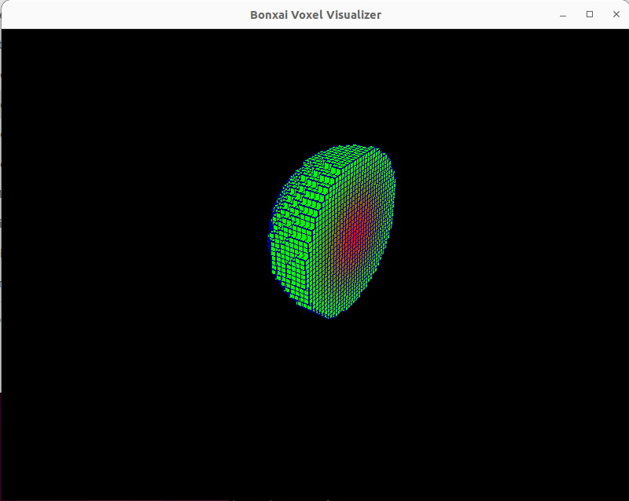

# Bonxai Visualizer
This project provides an easy-to-use visualization tool for Bonxai voxel grids. 



## Motivation:
Although the Bonxai data structure has many advantages over Octomap, it currently lacks visualization tools or Rviz2 integration. To address this, I created a simple OpenGL visualization tool for serialized Bonxai voxel grids.

For more info about the Bonxai project, visit its GitHub repo [here](https://github.com/facontidavide/Bonxai)\
For a visual demo of the project, check out [this video](https://youtu.be/ArYsIHcyb2I)

## Installation

1. Clone the repository from GitHub:
   ```bash
   git clone https://github.com/ErykHalicki/Bonxai-Visualizer.git
   ```
2. Navigate to the project directory:
   ```bash
   cd Bonxai-Visualizer
   ```
3. Create a build directory:
   ```bash
   mkdir build && cd build
   ```

4. Configure the build with CMake:
   ```bash
   cmake ..
   ```
   
5. Build the project:
   ```bash
   make
   ```

6. Install the executables (optional):
   ```bash
   sudo make install
   ```


## Usage
### Bonxai-Visualizer
To visualize a Bonxai voxel grid, run the visualizer executable followed by the path to the input file:

```bash
./bonxai-viz <input_file>
```

### Example
To create a sphere and store it in a file named test.bx, you can use the following command:
```bash
./bonxai-viz-serialization-test
```
or have something similar to this in your c++ project:
```cpp
 std::ofstream outputFile("test.bx", std::ios::binary);
  if (!outputFile.is_open()) {
    std::cerr << "Error: Unable to open file for writing" << std::endl;
    return 1;
  }

  Bonxai::Serialize(outputFile, grid);
  outputFile.close();
```

Then, you can visualize the generated data using the visualizer:

```bash
./bonxai-viz test.bx
```
### Requirements
OpenGL
GLFW3
Ensure that these dependencies are installed on your system before building the project.

Feel free to reach out if you encounter any issues or have any questions!
